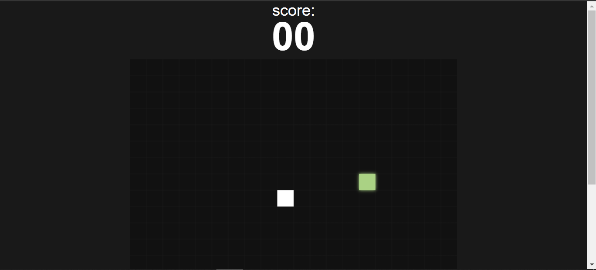

# JOGO DA COBRINHA
☑️JOGO EM HTML/CSS/JS.

   

## DESCRIÇÃO:
Este é um jogo simples de Snake (jogo da cobrinha) que utiliza o elemento `<canvas>` para renderizar os gráficos. Aqui está uma descrição das principais partes:

1. **Inicialização de variáveis**: O jogo começa selecionando elementos do DOM, como o `<canvas>`, e obtendo o contexto 2D para desenhar. Ele também seleciona elementos para exibir e atualizar o placar, o menu e o botão de jogar. Além disso, cria um elemento de áudio para reproduzir um som quando a cobrinha come a comida.

2. **Definição de constantes**: Define constantes para o tamanho dos blocos, a posição inicial da cobrinha e outras constantes utilizadas no jogo.

3. **Funções de utilidade**: Inclui funções para gerar números aleatórios, cores aleatórias e verificar colisões.

4. **Comida**: Gera a comida em uma posição aleatória dentro do `<canvas>` e a desenha.

5. **Cobrinha**: Desenha a cobrinha e move-a de acordo com a direção definida pelo jogador.

6. **Loop do jogo**: Implementa um loop de jogo que desenha os elementos na tela, move a cobrinha, verifica se ela comeu a comida e se houve colisões.

7. **Eventos do teclado**: Adiciona um ouvinte de eventos de teclado para controlar a direção da cobrinha.

8. **Manipulação do menu de jogo**: Adiciona um ouvinte de eventos para o botão de jogar, reiniciando o jogo quando pressionado.

## NÃO SABE?
- Entendemos que para manipular arquivos em `HTML`, `CSS` e outras linguagens relacionadas, é necessário possuir conhecimento nessas áreas. Para auxiliar nesse aprendizado, oferecemos cursos gratuitos disponíveis:
* [CURSO DE HTML E CSS](https://github.com/VILHALVA/CURSO-DE-HTML-E-CSS)
* [CURSO DE JAVASCRIPT](https://github.com/VILHALVA/CURSO-DE-JAVASCRIPT)
* [CONFIRA MAIS CURSOS](https://github.com/VILHALVA?tab=repositories&q=+topic:CURSO)

## CREDITOS:
- [PROJETO CRIADO PELO "manualdodev"](https://github.com/manualdodev/snake-game)
- [PROJETO EDITADO PELO VILHALVA](https://github.com/VILHALVA)
- [ESTÁ DISPONIVEL NO SITE](https://vilhalva.github.io/STYLER/STYLER.html)